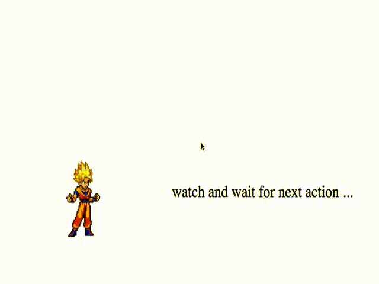

#Kamehameha — the way you perform infinite loading

## What is kamehameha?

> Kamehameha is a kind of energy attack in the [Dragon Ball](https://en.wikipedia.org/wiki/Dragon_Ball) series, and is [Goku](https://en.wikipedia.org/wiki/Goku)'s signature technique.

## How it goes with infinite loading

Let's simplify **kamehameha** and compare it with **infinite loading**:

| states  | action | kamehameha | infinite scrolling |
| --	 | -- | -- | -- |
| ready |  | watch on certain enemy | watch on scrolling event |
| triggering |  | make a right pose | scroll the page to bottom |
| locked | ... | can't be interrupted until finish the action | can't issue next request until finish current request |
| holding |  | collect energy | request data through ajax | 
| emitting |  | booom!!! | redering the results |
| resting |  | take a rest | delay a short period (to avoid request burst) |
| unlocked | ... | go back to ready state | go back to ready state |

## Kamehameha in action

